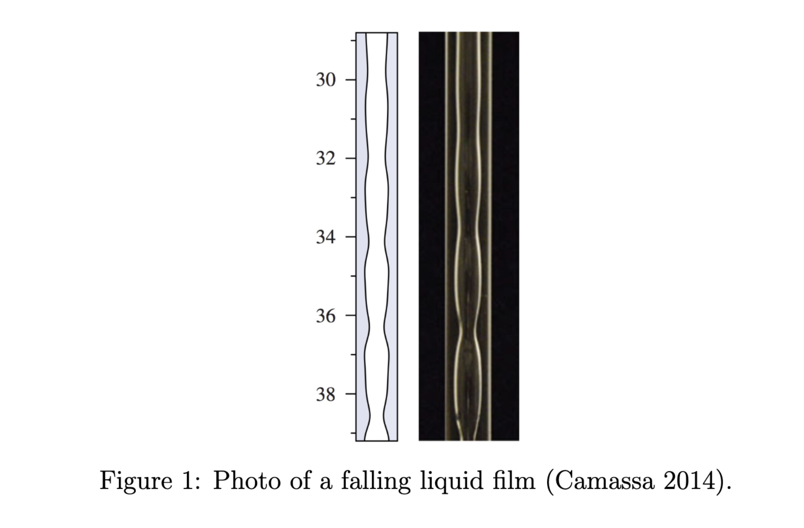

# probabilistic_plugging

## Overview 
This project is done with the help of my advisor Reed Ogrosky from Virginia Commonwealth University. It is used for parallel simulation of fluid flow under gravity and study of its dynamics. The code in this repository simulate two models. 

The first portion of the repository is dedicated to simulating the Partial Differential Equation (PDE) Model. PDE model is a Navier-Stokes derived model proposed in Camassa 2014. In particular, fluid under this configuration simulated in this model, features a "probabilistic tipping" dynamics in one region of its parameter space. We explores this transietn region of parameter space thoroughly to understand its behavior. The PDE model is already simplified, but still quiet computationally intensive. Hence, parallel processing is implemented with MATLAB's Parallel Computing Tool Box. 

The second portion of the codes are dedicated in simulating the ODE model.  To further dissect this dynamics, and for a faster model, we developed an Ordinary Differential Equation (ODE) model based on the PDE model. This model captures the probabilistic tipping dynamics, and we showed that their behaviors match. 

## Motivation - Probabilistic Plugging 

When liquid falls down a thin liquid tube under gravity, it forms a thin liquid film due to the surface tension. As it moves down, the surface of the film forms waves. The waves grows by itself, but also by interacting with other nearby waves, bigger waves swallowing smaller waves. If a wave grow too large, it forms a plug, the liquid stop flowing. This is an issue in engineering, in health like in the lungs of a patient with thick mucus. 
